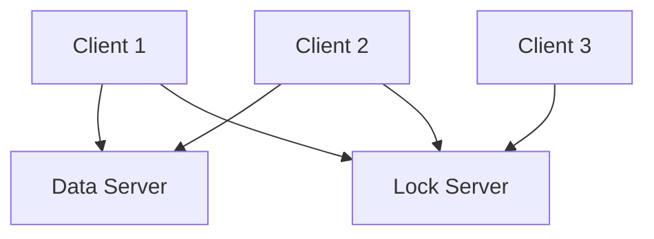

### Overview

**gAFFE** is an implementation from scratch of a file system whose architecture is inspired from Frangipani. Every client machine will operate an instance of gAFFE. This gAFFE instance will create a file system that's accessible to applications on that particular machine, with FUSE channeling the application file system tasks to gAFFE. All these gAFFE instances will store file system data in a single "data" server, ensuring all client machines access a consistent shared file system.

### Architecture




### Clients

In the context of gAFFE, the client is a component responsible for communicating with the data server storing the actual file data and metadata. It serves user requests for file operations.
When FUSE receives a file operation request (e.g., read a file), it passes it to the gAFFE client. The gAFFE client then interacts with servers to fulfill this request. For instance, it might retrieve the data from the data server or write data to it.

The collaboration between FUSE and the gAFFE client enables the creation of a distributed file system. A user interacts with the file system as if it's a local file system. The operating system forwards these interactions to FUSE. FUSE, in turn, hands over these operations to the gAFFE client, which then manages the complexities of the distributed system, such as obtaining a lock on the file from the lock server and interacting with that file on the data server. 

We would need to implement the following FUSE operators: CREATE/MKNOD, LOOKUP, READDIR, SETATTR, WRITE, READ, MKDIR, and UNLINK.

The client should first obtain the lock for the file or directory it's interacting with. Once lock is acquired the operation should be executed, and if there are any resultant effects, the data server should be updated accordingly. After all these steps, the lock should be released.

> Can we make lock acquisition and release more efficient by caching them on the client side?

### Data Server

Storage backbone of the distributed file system. The key purpose of the DataServer is to abstract and manage the allocation and mapping of storage in the distributed file system.

```sh
// Extent represents an extent of a file
type DatatServer struct {
  Data []byte
  Attr Attr // metadata
}

type Attr struct {
  // fields for attr
}

// DataStore stores extents
type DataStore interface {
  Put(id int, ext Extent) error
  Get(id int) (Extent, error)
  Remove(id int) error
}
```

> Can we make the data server crash-resilient using RAFT/PAXOS?

### Lock Service

The fundamental logic of the lock service is split into two main components: the LockClient and the LockServer. They interact using gRPCs. A client initiates a request for a specific lock from the LockServer using an Acquire method call. The LockServer then assigns the requested lock to a single client exclusively. Once a client completes its task with the allocated lock, it invokes the Release method to notify the server, allowing the server to potentially assign the lock to another awaiting client.


**LockServer**
```sh
type LockProtocol struct{	
}

func NewLockProtocol() *LockProtocol {	
}

func (lp *LockProtocol) Acquire(lockID int, _ *struct{})

func (lp *LockProtocol) Release(lockID int, _ *struct{})
```

**LockClient**
```sh
// Example: Acquire lock with ID 5
	lockID := 5
	err = client.Call("LockProtocol.Acquire", lockID, &struct{}{})
```

> Can we make lock server crash resilient using RAFT/PAXOS? (This might be easier than making data server crash resilient) 

### Disconnected operation

> Can we extend gAFFE to a system that will allow the user to make modifications to cached data, and create new files and directories, even if it cannot currently talk to the lock server or the data server?


### Refrences
- Using FUSE with golang: https://blog.gopheracademy.com/advent-2014/fuse-zipfs/
- LibFuse: https://github.com/libfuse/libfuse
- Frangipani paper: https://pdos.csail.mit.edu/archive/6.824-2004/papers/thekkath-frangipani.pdf